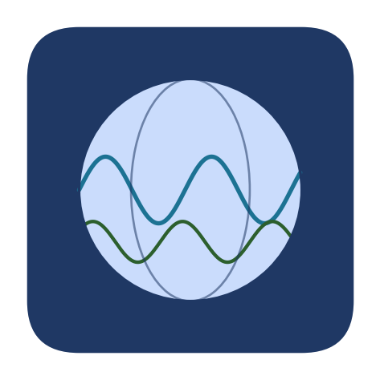

<div align="center">



# Interlinking Research Infrastructures
### A Focus on Geoscience & Climate — EPOS ON Summer School

[](https://epos-summer-school-2026.readthedocs.io/en/latest/)
[](LICENSE)
[](https://mybinder.org/v2/gh/Juliano1111-ai/EPOS_Summer_School_2026/main)
[](https://jupyterbook.org)

**📖 Read the rendered course online → [epos-summer-school-2026.readthedocs.io](https://epos-summer-school-2026.readthedocs.io)**

</div>

---

Teaching materials for the practical session of the lecture *“Interlinking Research
Infrastructures: A Focus on Geoscience and Climate”* at the
[EPOS Open Science](https://www.epos-eu.org/on) Summer School. The module shows how to
combine four European environmental **Research Infrastructures** — each with a different
data-access protocol — into a single scientific analysis.

| Domain | Infrastructure | Access mechanism |
|---|---|---|
| Climate reanalysis | **ECMWF** (ERA5) | API retrieval (`cdsapi`) |
| Climate in-situ | **ARGO** (BGC-Argo) | ERDDAP tabledap |
| Climate observation | **CMEMS** | OpenDAP / `copernicusmarine` |
| Solid earth | **GFZ / FDSN** | Seismic web services (`obspy`) |

## What's inside

```
EPOS_Summer_School_2026/
├── docs/                              ← Jupyter Book source (the website)
│   ├── intro.md   setup.md   references.{md,bib}
│   ├── application_1_argo_cmems/      ← Application 1: ARGO & CMEMS
│   │   ├── epos_argo_cmems.ipynb
│   │   └── cmems_data/                ← demo Sea-Level Anomaly subset
│   └── application_2_ecmwf/           ← Application 2: ECMWF & seismicity
│       ├── epos_ecmwf.ipynb
│       ├── epos_school_function.py    ← shared plotting/helper functions
│       └── epos_data/                 ← EPOS earthquake catalogue (CSV)
├── slides/                            ← lecture deck (.pptx + .pdf)
├── requirements.txt  environment.yml  ← run the notebooks
├── .readthedocs.yaml                  ← builds the site on Read the Docs
└── .github/workflows/deploy-pages.yml ← alternative: GitHub Pages
```

## Quickstart

```bash
git clone https://github.com/Juliano1111-ai/EPOS_Summer_School_2026.git
cd EPOS_Summer_School_2026
mamba env create -f environment.yml   # or: pip install -r requirements.txt
conda activate epos-school
jupyter lab
```

The notebooks call live data services that need **free** credentials (Copernicus Marine
and the Copernicus Climate Data Store). See the
[Setup page](https://epos-summer-school-2026.readthedocs.io/en/latest/setup.html) for the
5-minute registration. The small demo datasets ship with the repo, so the offline parts
run immediately.

## Publishing the website

The site is a [Jupyter Book](https://jupyterbook.org) and can be hosted two ways:

- **Read the Docs** (recommended): connected via [`.readthedocs.yaml`](.readthedocs.yaml).
  Import the repo at [readthedocs.org](https://about.readthedocs.com) and every push
  rebuilds the site.
- **GitHub Pages**: the workflow in [`.github/workflows/deploy-pages.yml`](.github/workflows/deploy-pages.yml)
  builds and deploys on every push to `main`.

Build it locally with:

```bash
pip install -r docs/requirements.txt
jupyter-book build docs/
# open docs/_build/html/index.html
```

## License

Content (text, notebooks, slides) is released under
[**CC BY 4.0**](LICENSE). Please attribute when reusing.

## Citation

> Ramanantsoa, H. J. D. (2025). *Interlinking Research Infrastructures: A Focus on
> Geoscience and Climate* — EPOS ON Summer School teaching materials.

See [`CITATION.cff`](CITATION.cff).

---

*Author:* **Heriniaina Juliano Dani Ramanantsoa**, University of Bergen ·
✉️ heriniaina.j.ramanantsoa@uib.no
